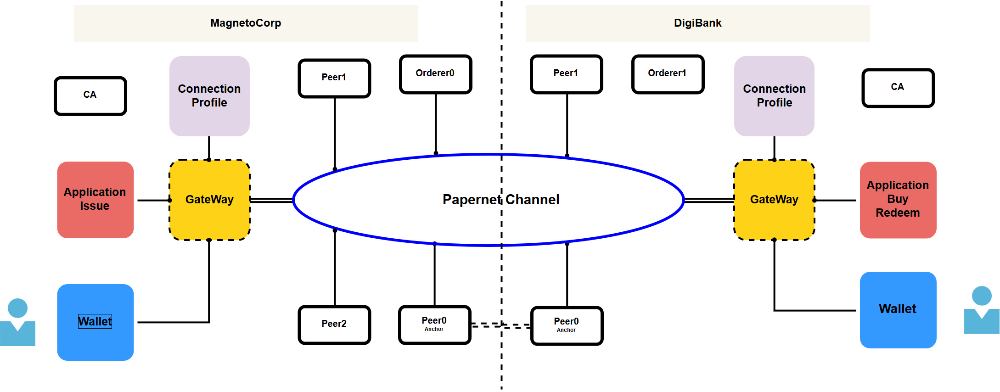
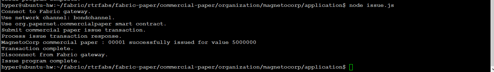
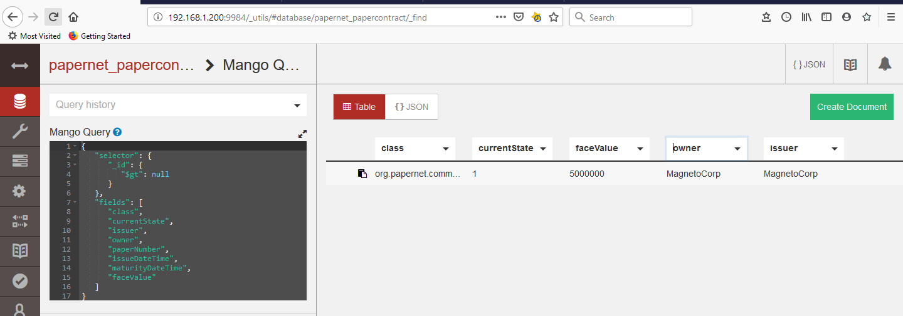
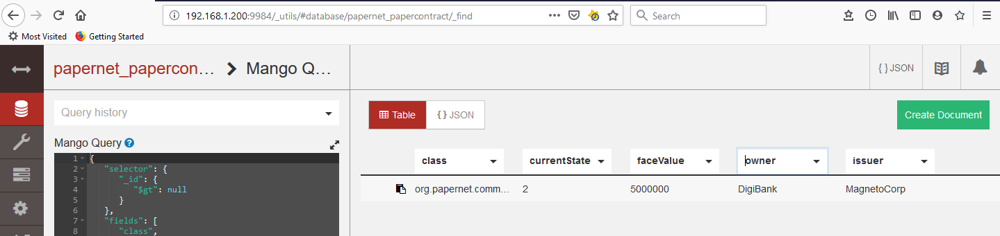
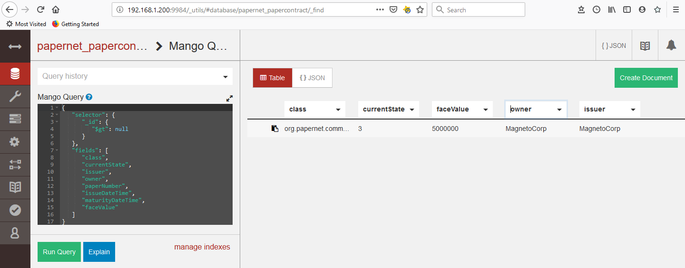

# Hyperledger Fabric Smart Contract

In this article we will implement the commercial paper smart contract in a network as described by this [section](https://hyperledger-fabric.readthedocs.io/en/release-1.4/developapps/gateway.html) from the user guide. A Hyperledger Fabric network channel can constantly change.  The peer, orderer and CA components, contributed by the different organizations in the network,will come and go. 

This article follows the commercial paper smart contract model of MagnetoCorp and DigiBank as shown below.



In PaperNet commercial paper network. two organizations Magneto Corp and Digibank uses PaperNet
network to issue, buy, and redeem commercial paper. Refer the [link](https://hyperledger-fabric.readthedocs.io/en/release-1.4/developapps/scenario.html) for more details on the process.

We will be deploying the Hyperledger Fabric network consisting of MagnetoCorp organization, maintaining three peer nodes, one orderer with ‘solo’  ordering service. We will create a channel papernet , add Digibank organization's two peers to the papernet channel , by following [adding org to channel](https://hyperledger-fabric.readthedocs.io/en/release-1.4/channel_update_tutorial.html) procedure. 

After the network is setup we will install commercial paper smart contract package and instantiate the contract on papernet channel. We will configure connection profiles for the network gateway to manage the network interactions for both organizations. We will invoke issue,buy and redeem transactions of paper contract. We will also register users , use the corresponding  wallet and identities of respective organizations during these transactions.

Lets start by creating the network config for Magnetocorp.

**Magnetocorp : Configure the Network**

- Generate the Network Artifacts

- Start CA Servers.

- Start the Magnetocorp network

- Create channel '***papernet***', join the peers and update anchor peer

  ```bash
  #Refer Github repo for details
  
  cd magntocorp
  cryptogen generate --config=./crypto-config.yaml
  
  configtxgen -profile MagnetoCorpGenesis -channelID mc-sys-channel -outputBlock ./config/magneto.genesis.block
  
  export CHANNEL_NAME=papernet
  
  configtxgen -profile PapernetChannel -outputCreateChannelTx ./config/papernetchannel.tx -channelID $CHANNEL_NAME
  
  echo $CHANNEL_NAME
  configtxgen -profile PapernetChannel -outputAnchorPeersUpdate ./config/MagnetoCorpanchors.tx -channelID $CHANNEL_NAME -asOrg MagnetoCorpMSP
  
  docker-compose -f docker-compose-ca.yaml up -d
  docker-compose -f docker-compose-mcorp.yaml up -d
  docker-compose -f docker-compose-cli.yaml up -d
  ```


**DigiBank: Configure the Network**

- Generate the Network Artifacts

```bash
#Refer Github repo for details

cd digibank
cryptogen generate --config=./crypto-config.yaml
configtxgen -profile DigiBankGenesis -channelID db-sys-channel -outputBlock ./config/digibank.genesis.block

export CHANNEL_NAME=digibankchannel

configtxgen -profile PapernetChannel -outputCreateChannelTx ./config/digibankchannel.tx -channelID $CHANNEL_NAME
```


**Join DigiBank peers to the *papernet* Channel.**

We will add the two peers to the papernet channel and update anchor peers of DigiBank organization , by following [adding org to channel](https://hyperledger-fabric.readthedocs.io/en/release-1.4/channel_update_tutorial.html) procedure. 

Add Digibank Peers to Channel

```bash
#Refer Github repo for details
cd config/channel
configtxgen -printOrg DigiBankMSP > ../magnetocorp/config/channel/DigiBankMSP.json

# exec into the CLI container
docker exec -it cli.peer0.mgc bash
cd config/channel
# command saves the binary protobuf channel configuration block to config_block.pb
peer channel fetch config config_block.pb -o orderer.MagnetoCorp.com:7050 -c $CHANNEL_NAME --tls --cafile $ORDERER_CA

# decode config_block.pb channel configuration block into JSON format
configtxlator proto_decode --input config_block.pb --type common.Block | jq .data.data[0].payload.data.config > config.json

# append the DigiBankMSP configuration definition to MagnetoCorp
jq -s '.[0] * {"channel_group":{"groups":{"Application":{"groups": {"DigiBankMSP":.[1]}}}}}' config.json DigiBankMSP.json > modified_config.json

# translate config.json back into a protobuf called config.pb:
configtxlator proto_encode --input config.json --type common.Config --output config.pb

# encode modified_config.json to modified_config.pb:
configtxlator proto_encode --input modified_config.json --type common.Config --output modified_config.pb

# use configtxlator to calculate the delta between these two config protobufs. This command will output a new protobuf binary named DigiBankMSP_update.pb:
configtxlator compute_update --channel_id $CHANNEL_NAME --original config.pb --updated modified_config.pb --output DigiBankMSP_update.pb

# decode DigiBankMSP_update.pb into editable JSON format and call it DigiBankMSP_update.json:
configtxlator proto_decode --input DigiBankMSP_update.pb --type common.ConfigUpdate | jq . > DigiBankMSP_update.json

# wrap in an envelope message
echo '{"payload":{"header":{"channel_header":{"channel_id":"papernet", "type":2}},"data":{"config_update":'$(cat DigiBankMSP_update.json)'}}}' | jq . > DigiBankMSP_update_in_envelope.json

# update object DigiBankMSP_update_in_envelope.pb: 
configtxlator proto_encode --input DigiBankMSP_update_in_envelope.json --type common.Envelope --output DigiBankMSP_update_in_envelope.pb

# MegnetoCorpMSP Signature
peer channel signconfigtx -f DigiBankMSP_update_in_envelope.pb

peer channel update -f DigiBankMSP_update_in_envelope.pb -c $CHANNEL_NAME -o orderer.MagnetoCorp.com:7050 --tls --cafile $ORDERER_CA

#verify New Block Creation
docker logs peer0.MagnetoCorp.com

```

**Start the DigiBank Network**

```bash
cd digibank

docker-compose -f docker-compose-digibank.yaml up -d
docker-compose -f docker-compose-cli.yaml up -d
```

**Update anchor peers of DigiBank organization** by following [update anchor peer](https://hyperledger-fabric.readthedocs.io/en/release-1.4/channel_update_tutorial.html) procedure. 

```bash
#save the binary protobuf channel configuration block
peer channel fetch config config_block.pb -o orderer.MagnetoCorp.com:7050 -c $CHANNEL_NAME --tls --cafile $ORDERER_CA

# Conver to Human Readable Format
configtxlator proto_decode --input config_block.pb --type common.Block | jq .data.data[0].payload.data.config > config.json

# Add Anchor Peer
jq '.channel_group.groups.Application.groups.DigiBankMSP.values += {"AnchorPeers":{"mod_policy": "Admins","value":{"anchor_peers": [{"host": "peer0.DigiBank.com","port": 17051}]},"version": "0"}}' config.json > modified_anchor_config.json

# jq '.channel_group.groups.Application.groups.MagnetoCorpMSP.values += {"AnchorPeers":{"mod_policy": "Admins","value":{"anchor_peers": [{"host": "peer0.MagnetoCorp.com","port": 7051}]},"version": "0"}}' config.json > modified_anchor_config.json

# Translate config.json back into protobuf format as config.pb
configtxlator proto_encode --input config.json --type common.Config --output config.pb

# Translate the modified_anchor_config.json into protobuf format as modified_anchor_config.pb
configtxlator proto_encode --input modified_anchor_config.json --type common.Config --output modified_anchor_config.pb

# Calculate the delta between the two protobuf formatted configurations.
configtxlator compute_update --channel_id $CHANNEL_NAME --original config.pb --updated modified_anchor_config.pb --output anchor_update.pb

# use the configtxlator command again to convert anchor_update.pb into anchor_update.json
configtxlator proto_decode --input anchor_update.pb --type common.ConfigUpdate | jq . > anchor_update.json

# wrap the update in an envelope message, restoring the previously stripped away header, 
# outputting it to anchor_update_in_envelope.json
echo '{"payload":{"header":{"channel_header":{"channel_id":"papernet", "type":2}},"data":{"config_update":'$(cat anchor_update.json)'}}}' | jq . > anchor_update_in_envelope.json

# convert it to a protobuf so it can be properly signed and submitted to the orderer for the update.
configtxlator proto_encode --input anchor_update_in_envelope.json --type common.Envelope --output anchor_update_in_envelope.pb

# use the peer channel update command as it will also sign off on the update as the Org3 admin before submitting it to the orderer.
peer channel update -f anchor_update_in_envelope.pb -c $CHANNEL_NAME -o orderer.MagnetoCorp.com:7050 --tls --cafile $ORDERER_CA

#verify logs for anchor peer
docker logs -f peer0.org1.example.com
```

**Install Paper contract**
Install paper contract on all peer nodes in PaperNet channel . (use package method)

```bash
peer chaincode package contractpack.out -n papercontract -l node -p /opt/gopath/src/github.com/magnetocorp/contract -v 1.0 -s -S

peer chaincode install contractpack.out
```

**Instantiate paper Contract on Papernet Channel**

```bash
peer chaincode instantiate -o orderer.MagnetoCorp.com:7050 -C $CHANNEL_NAME  -n papercontract -v 1.0 -l node -c '{"Args":["org.papernet.commercialpaper:instantiate"]}' --tls --cafile $ORDERER_CA  -P  "OR ('MagnetoCorpMSP.peer','DigiBankMSP.peer')"

```

**Network Connection Profile**

Now Lets us issue the commercial paper contract ad Magnetocorp.

Before that we need to configure the connection profile for both organizations.

```bash
cd commercial-paper/organization/magnetocorp/gateway/networkConnection.yaml
cd commercial-paper/organization/digibank/gateway/networkConnection.yaml
Refer Github repo for details
```

**Wallet**

After creating the connection profiles We will then register users , import the registered identities to corresponding  wallets. MagnetoCorp uses **ca-MagnetoCorp.com** to issue identities and DigiBank uses ***ca-DigiBank.com*** to issue identities. These identities are stored in user wallets in each organization.

- user bondissuer1@MagnetoCorp.com in MagnetoCorp.
- user bondbuyer1@DigiBank.com in DigiBank organization

```bash
cd commercial-paper/organization/magnetocorp/application
npm install

node enrollAdmin.js
node register-issuer-1.js
```

**Invoke Issue Transaction**

Perform issue transaction as bondissuer1@MagnetoCorp.com from MagnetoCorp.

Below code connected to papernet channel though a gateway using the connection profile and bondissuer1 user.

```bash
cd commercial-paper/organization/magnetocorp/application
node issue.js
```

Results would show in CLI like below.



Now lets us find the results of transaction from the couchdb interface for DigiBank Peer1.

open the link http://peer0.digibank.com:9984/_utils/#database/papernet_papercontract/_find

In the mango query window add the following query.

```sql
{
   "selector": {
      "_id": {
         "$gt": null
      }
   },
   "fields": [
      "class",
      "currentState",
      "issuer",
      "owner",
      "paperNumber",
      "issueDateTime",
      "maturityDateTime",
      "faceValue",
      "price"
   ]
}
```

Results



The current state =1 which is issue transaction.Owner and Issuer is both MagentoCorp.

**Buy paper contract**

Below commands Registers bondbuyer1 user , imports the registered identity to digibank user wallet.

```bash
cd commercial-paper/organization/digibank/application/
npm install

node enrollAdmin.js
node register-buyer-1.js
```

**Invoke buy transaction** as Digibank user  bondbuyer1@Digibank.com .

```bash
cd commercial-paper/organization/digibank/application/
node buy.js
```

Lets review the results again from couchdb interface. Rerun the query above from any peers link.



The current state =2 which is buy transaction. Owner=Digibank  and Issuer is MagentoCorp

**Invoke redeem transaction** as Digibank user  bondbuyer1@Digibank.com user

```bash
cd commercial-paper/organization/digibank/application/

node redeem.js
```

Lets review the results again from couchdb interface. Rerun the query above from any of the peers link.



The current state =3 which is redeem transaction. Owner=MagentoCorp and Issuer is MagentoCorp